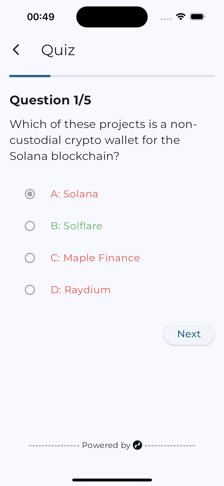
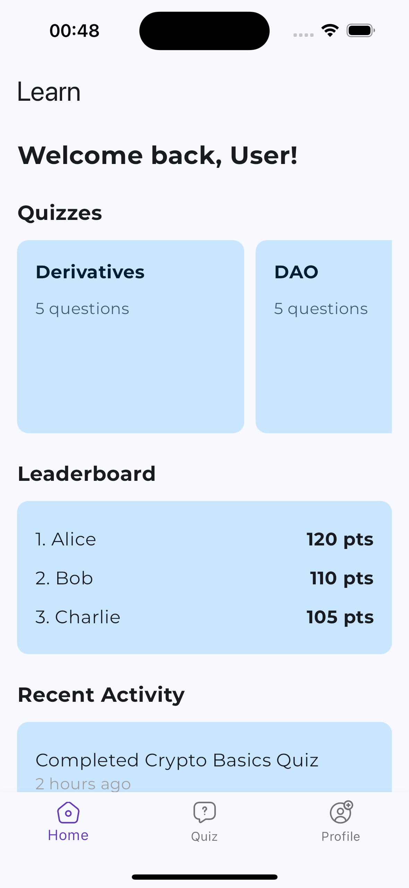
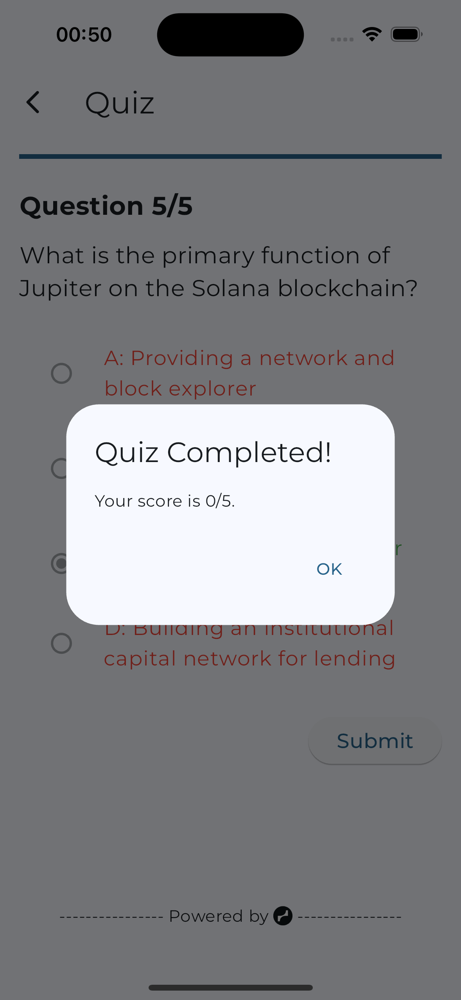
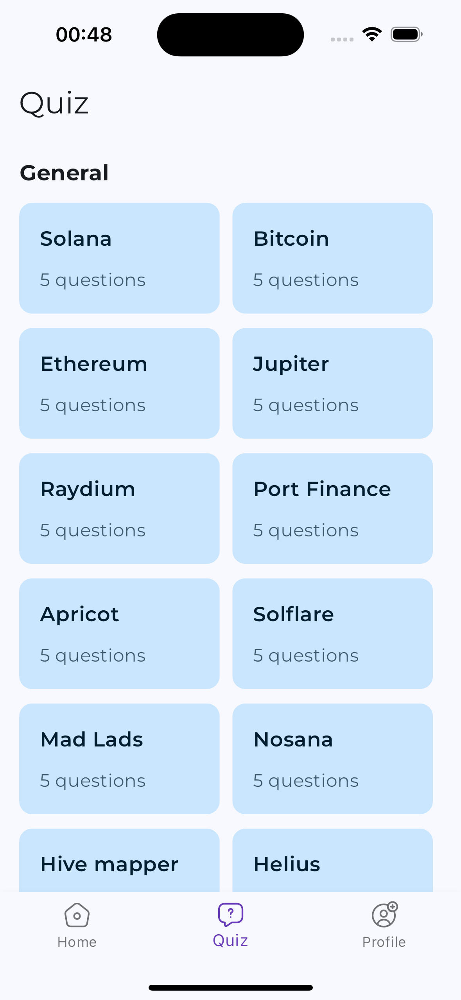
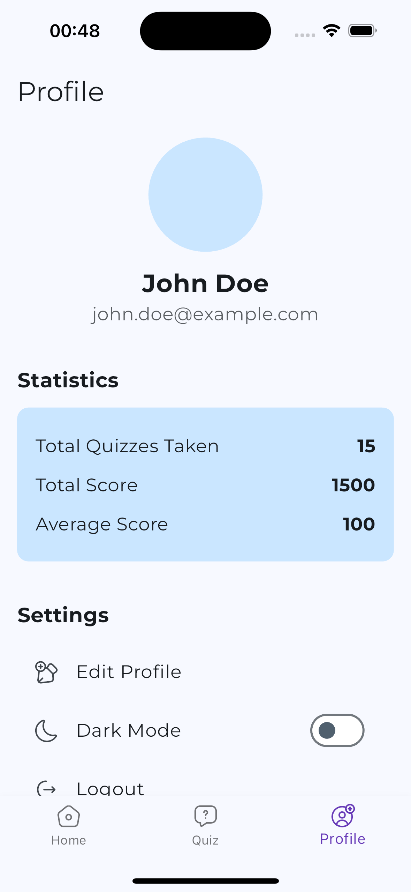

# learn

## Overview

Learn is a quiz app designed to educate users about the Solana ecosystem. Users can choose quiz topics, which the app queries using The Grid API, and questions are generated using the Gemini API.

## Features

- **Topic Selection:** Choose from various Solana ecosystem-related topics.
- **Question Generation:** Utilizes The Grid API and Gemini API for real-time question generation.
- **Score Tracking:** Tracks and displays user scores.
- **Leaderboard:** Shows top scores of users.

## Integration with The Grid API

### The Grid API Usage

- **Endpoint:** [The Grid API Documentation](https://thegrid.id/docs)
- **Data Queried:** Solana projects, teams, and companies.

#### Example Query

```dart
final response = await http.get(Uri.parse('https://thegrid.id/api/projects'));
if (response.statusCode == 200) {
  // Parse response and generate questions
} else {
  // Handle error
}
```

## Features

- **Topic Selection:** Choose from various Solana ecosystem-related topics.
- **Question Generation:** Utilizes The Grid API and Gemini API for real-time question generation.
- **Score Tracking:** Tracks and displays user scores.
- **Leaderboard:** Shows top scores of users.

## Screenshots

### Quiz Screen Displaying the quiz correction system



### Home Screen



### Quiz completed screen



### Select Quiz niche



### Profile Screem



## Setup Instructions

### Prerequisites

- Flutter installed on your machine. Follow the instructions ([Test live here](https://appetize.io/app/b_fhq3l5zt3xt7natrel5fx32cb4)) to install Flutter.

### Steps

1. **Clone the Repository**

   ```sh
   git clone https://github.com/immadominion/simple_shopping_app.git
   cd simple_shopping_app
   ```

````

2. **Get Flutter Packages**

   ```sh
   flutter pub get

   ```

3. **Run the App**
   ```sh
   flutter run
   ```

## Appetize Demo

- You can view a live demo of the app on Appetize.io ([here](https://appetize.io/app/b_dx7acejrjwag3bnw5qwirb4qwa))

## Project Structure

    lib/
    |- main.dart
    |- core/
    |   |- constants/
    |   |    |- enum.dart
    |- data/
    |   |- model/
    |   |- controllers/
    |   |- local/
    |   |- services/
    |   |- types/
    |   |- presentation/
    |       |- screens/
    |           |- home.dart/
    |           |- profil.dart/
    |           |- quiz_list.dart/
    |           |- quiz.dart/
    |       |- widgets/
    |           |- home.dart/
    |           |- profile.dart/
    |           |- quiz.dart/
    |       |- shimmer_loading.dart/
    |       |- shimmer.dart/
    |    |- lobator.dart/
    |
    |- utils/
    |- home.dart
    |- main.dart

## Code Overview

### Main file

- Main File (lib/main.dart): Contains the main entry point of the app, sets up navigation, and manages the state of the checkout list.
````
